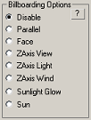
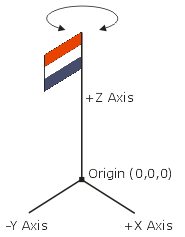
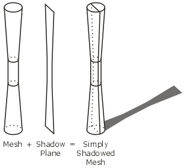
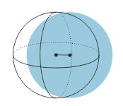
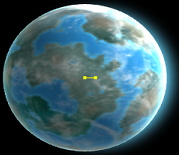
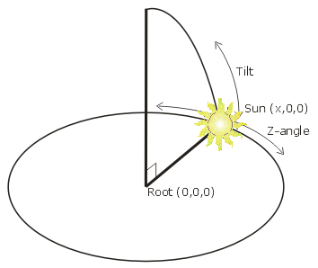

# Understanding billboarding

So, you're modeling away happily and have always ignored the 'Billboarding Options' in the Alamo Utility not knowing what the hell it does.
Then, one day, you feel brave and decide to click the taunting question mark button, expecting at least an explanation of the options. Well, think again.

> Billboarding re-aligns the transform of the selected node to face the camera in various ways. For billboarding to work correctly you must align the axes of the node with the world build your model such that its front is the side you expect to see aligned to the camera.

Uhuh, right. vague!

For kicks, lets see what [Wikipedia](http://en.wikipedia.org/wiki/Sprite_(computer_graphics)) has to say on the issue:

> Billboarding is one term used to describe the use of sprites in a 3D environment. In the same-way that a billboard is positioned to face drivers on a highway, the 3D sprite always faces the camera.

Yeah, I already knew that. In fact, I think most of you reading this would know this. That's why the Alamo Utility's help doesn't clarify a lot.

It has seven (!) ways to billboard a plane (not counting "Disable", of course), in what way do they differ? And what the hell is the 'front' exactly?

After reading this, you'll know the answers to both questions.

## Billboarding
I won't go into great lengths to explain the (simple) principles behind billboarding here. All I will say is that billboarding generally means orienting a 2d sprite to always face in a certain direction (e.g., to the camera).

For more information, I direct you to [Google](http://www.google.com/). I'm sure you can find some material.

Here, I'll explain exactly what type of billboarding Empire at War uses.

## The front
No, I don't mean [a movie starring Woody Allen](http://www.imdb.com/title/tt0074554/), I mean the direction that is considered the front by the Alamo Engine. Simply put, the front corresponds with 3D Studio Max's default 'front' viewport and is therefore the **negative Y axis**.
I.e., imagine sitting at the negative Y axis and looking at your model, positioned at the origin. The side of the model you now see is the front.

There, easy part's over.

## Billboarding: Disable
Don't billboard. Or, as [Samuel L. Jackson](http://www.imdb.com/name/nm0000168/) might say to the Alamo Engine: _"Keep your motherf\*\*\*ing hands off the motherf\*\*\*ing mesh."_

This doesn't do any special transforms to orient the mesh in any way. Default setting for new meshes.

## Billboarding: Parallel
The simplest, and standard, billboard technique. The mesh is rotated around its origin to have its front (-Y axis) face the camera, before being transposed to the bone's position.

Use this when you want a sprite to keep its position in the model, but always face the camera.

## Billboarding: Face
Identical to "Parallel". Not used by any model in the game.

## Billboarding: ZAxis View
This is very similar to "Parallel". Instead of rotating the mesh around the X, Y and Z axes to point the -Y axis to the camera, the mesh is only rotated around the Z axis.

## Billboarding: ZAxis Wind
In every land map, the Nature settings contain the direction of the wind. With this billboarding type the mesh is rotated around the Z axis such that the negative Y-axis is oriented in the same direction as the wind.

This is used for things whose orientation depends on the direction of the wind, such as flags.

Interesting note:
Open the map editor and place a R_GROUND_BARRACKS_BUILD_PAD (Object page, GROUNDBUILDABLE group).
Notice how in the center it contains a flagpole with a flag. Now also notice the direction in which the clouds are moving (look at their shadow on the surface). This is the direction of the wind. Notice how the flag is perpendicular to this direction.

In fact, change the Wind direction in the Nature page and notice how the flag moves along, but always stays perpendicular to the wind direction. This is an error made by the modeler.

Instead of *aligning* the flag with the -Y axis, he made the *front of the flag* face the -Y axis. This is a good example of miscommunication between the programmers and modelers.

## Billboarding: ZAxis Light

This is very similar to "ZAxis Wind". Instead of rotating the mesh around the Z Axis to match the wind direction, the mesh is rotated around the Z Axis to match the *light* direction.

This is very useful for creating optimized shadows. If, for example, you have a narrow, circular symmetrical object (like a streetlight), it's easier and more efficient to define a shadow plane that always faces the light (thus casting a proper shadow) than creating a full blown shadow mesh for it.

## Billboarding: Sunlight Glow

This technique is used to keep a bone on a fixed offset relative to the camera.
This is used for the planets in Galactic Conquest view. Most planets consist of two objects: a sphere that is the actual planet and a plane that contains a 'glow' texture. This glow texture is positioned slightly next to the center of the planet, making it seem as if the Sun is almost behind the horizon.

If you look at the image below, the planet is located at the root (0,0,0). The blue circle represents the plane with the glow texture and is slightly offset from the planet, as indicated by the line connecting the center of the planet at (0,0,0) with the center of the glow plane at (x,0,0).

Now, because this glow plane must *always* be offset slightly to the right of the planet, the trick is not that the plane must be rotated around its origin to face the camera, but that the plane must be rotated around its parent (root) to face the camera.

## Billboarding: Sun

This technique is used to properly position and orient the sun in skybox meshes.
In every skybox mesh, the plane with a picture of the sun on it is positioned on the X-axis (at <x,0,0>), slightly inside the sky mesh, with the plane facing front (negative Y) as usual.

In every land map, the Nature settings contain the "Z angle" and "tilt" (angle above the horizon) of the sun. By marking a plane with this billboard technique the engine ensures the plane is:

1. rotated around its origin to face the view, and
1. rotated around its parent's origin to match the map's sun settings

So, since (x,0,0) corresponds with 0° Z-angle and 0° tilt, this means the bone is simply rotated relative to its parent (often root) around the Z-axis, and then around the XY axis perpendicular to the resulting vector to obtain the proper tilt.

If this sounds difficult, just open the map editor, set a sky box, place the camera low to the ground so you can see most of the sky, and start playing with the Sun's settings, and watch how the sun moves along the sky.

