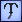
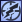

# Unit Abilities (Empire at War)

|   | Name | Description |
| - | - | - |
|  | AREA_EFFECT_CONVERT | Converts all enemy units to your control. Converted units die after an amount of time. |
|  | AREA_EFFECT_HEAL | Heals friendly units within a certain distance. |
|  | AREA_EFFECT_STUN | Stuns all units with STUNNABLE behavior. Stunned units cannot move, shoot or activate abilities. |
|  | BARRAGE | Commences a barrage on a target location. |
|  | CABLE_ATTACK | Executes a cable attack on the specified target unit. |
|  | CAPTURE_VEHICLE | Captures the target vehicle. |
|  | CONCENTRATE_FIRE | Orders nearby friendly units to concentrate fire on the target object. |
|  | DEFEND | Increases shield strength at cost of other attributes. |
|  | DEPLOY | Deploys the unit. The meaning of deployment is unit-specific |
|  | DEPLOY_TROOPERS | Deploys units from the unit. |
|  | EJECT_VEHICLE_THIEF | Orders the vehicle thief to exit the unit. |
|  | ENERGY_WEAPON | Fires the unit's energy weapon at the target object. |
|  | FIRE_LOBBING_SUPERWEAPON | Fires a superweapon projectile. |
|  | FLAME_THROWER | Fires the unit\'s flamethrower at the target object. |
|  | FORCE_LIGHTNING | Attacks the target object with lightning. |
|  | FORCE_TELEKINESIS | Uses Force Crush on the target object. |
|  | FORCE_WHIRLWIND | Uses Force Push. Force Push pushes nearby units away with deadly force. |
|  | FOW_REVEAL_PING | Reveal the Fog of War at the target location for a short period of time. |
|  | HARMONIC_BOMB | Drops a harmonic bomb at the unit's current position. |
|  | HUNT | Orders the unit to hunt for the enemy. |
|  | INTERDICT | Activates the unit's Gravity Generators, preventing all ships from retreating into hyperspace. When this ability is active, the unit cannot move. |
|  | INVULNERABILITY | Makes the unit temporarily invulnerable to damage for a short period of time. |
|  | ION_CANNON_SHOT | The unit will make an attack run at the target object with Ion Cannons. |
|  | JET_PACK | Activates the unit's Jet Pack. This enables the unit to fly over obstacles. |
|  | LUCKY_SHOT | Makes the unit perform a "Lucky Shot" at the target object. Lucky Shots do extremely more damage than ordinary attacks. |
|  | LURE | Makes the unit lure enemy units, distracting them away from other friendly units. |
|  | MAXIMUM_FIREPOWER | Hits the target object with an increased damage attack. |
|  | MISSILE_SHIELD | Generates a missile jamming field that disrupts the targeting systems of nearby missiles. When this ability is active, the unit cannot move. |
|  | POWER_TO_WEAPONS | Divert power to the weapons, increasing their strength and fire rate, at the cost of other attributes such as engines and shields. |
|  | REPLENISH_WINGMEN | Replenishes the rest of the squadron, should they have been killed. |
|  | ROCKET_ATTACK | Switches the unit to rockets for attacking. |
|  | SELF_DESTRUCT | Makes the unit self-destruct after a short overload time. |
|  | SPOILER_LOCK | Locks S-Foils, increasing movement speed, but at reduced firepower. |
|  | SPREAD_OUT | Spreads the unit of a squadron out, increasing their defense, but reducing their movement speed. |
|  | SPRINT | Gives the unit a substantial, but short increase in speed. |
|  | STICKY_BOMB | Makes the unit fire a 'sticky bomb' at the target object. The bomb will detonate after a certain period of time. |
|  | TARGETED_HACK | Makes the unit hack into the target object, causing the object's ownership to switch to the unit's owner. |
|  | TARGETED_INVULNERABILITY | Temporarily increases the defense of the units inside the target area. |
|  | TARGETED_REPAIR | Makes the unit repair the target friendly object, restoring (part) of the object's hitpoints. |
|  | TRACTOR_BEAM | Activates the unit's tractor beam at the target object, causing a substantial loss of speed of the object. |
|  | TURBO | Increases the unit's engine power, causing a substantial increase of speed at the cost of other attributes such as shield and weapons strength. |
|  | UNTARGETED_STICKY_BOMB | Makes the unit drop a bomb at its location which will detonate after a certain period of time. |
|  | WEAKEN_ENEMY | Temporarily reduces the attack damage done by enemy units in the target area. |</table>
